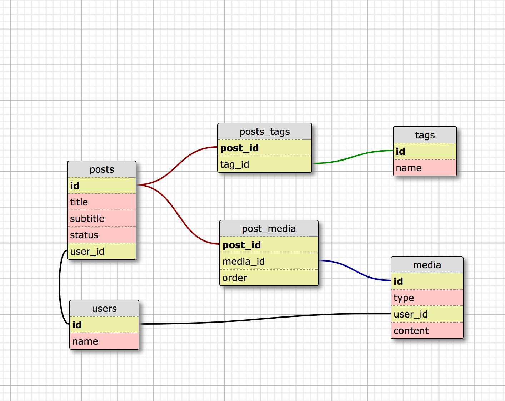

# cms-demo
Demo of content management system

# Installation

Prerequisites: node, PostgreSQL

`git clone https://github.com/EthanJStark/cms-demo.git` - Clone the repo

`createdb cms-demo` - Create the database

`npm i` - Install dependencies

Correct the path to the database: find the two instances of `estark` and replace them with the result of typing `whoami` in your terminal.

`npm run migrate:latest` - run migrations

User must manually populate the database

## Schema

